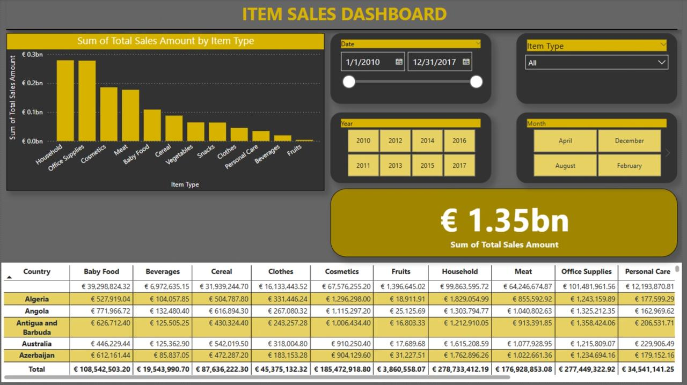

# Power BI – Global Sales Analytics Dashboard

This repository presents a comprehensive **interactive sales analytics dashboard** built with Microsoft Power BI. The report visualizes global sales performance across product categories, countries, and time, offering valuable insights into both high-level KPIs and detailed breakdowns.

---

## Overview

The dashboard is designed for decision-makers, analysts, and business stakeholders seeking a quick yet detailed understanding of sales performance across multiple dimensions.

Users can interactively filter data by:
- **Year**
- **Month**
- **Date Range**
- **Item Type**

The dashboard supports real-time exploration of sales patterns, category performance, and country-level contributions.

---

## Key Features

### 1. Executive KPIs  
- **Total Sales Amount:** Displays the total revenue generated within the selected filters.  
- Designed with emphasis, large type, and high-contrast background for quick management reference.

### 2. Interactive Filters (Slicers)  
- Users can narrow data by **Year**, **Month**, **Date Range**, and **Item Type**  
- Slicers are placed strategically at the top right for quick access without interfering with data visuals.

### 3. Sales by Item Type (Bar Chart)  
- A bar chart presenting total sales grouped by item categories such as Household, Office Supplies, Meat, etc.  
- Enables comparative performance analysis across product lines.

### 4. Detailed Country and Category Matrix  
- A pivot-style table displaying sales data for each product category by country  
- Includes totals for each category, highlighting geographic trends and regional strengths.

---

## Dashboard Preview (Dark Theme)



---

## Technologies Used

- **Microsoft Power BI Desktop**  
- **DAX Measures** for KPI calculation and future metrics  
- **Excel-based dataset (`ITEMSALES.xlsx`)**  
- **Custom layout and theming** using a dark/yellow palette for contrast and readability

---

## Files in this Repository

```plaintext
├── salesDashboard.pbix           # Main Power BI report file
├── ITEMSALES.xlsx                # Original data source
├── screenshots/
│   └── item_sales_dashboard.jpeg # Updated dashboard preview
├── README.md                     # Project documentation
---
```
Use Case

This dashboard can be applied in real-world scenarios such as:
	•	Retail sales monitoring
	•	Quarterly executive reporting
	•	Product category trend analysis
	•	Country-level performance benchmarking

The design is modular and can be expanded with additional visuals such as:
	•	Monthly revenue trend (line chart)
	•	Category share (donut/pie chart)
	•	Return Rate KPI
``
	•	Retail sales monitoring
	•	Quarterly executive reporting
	•	Product category trend analysis
	•	Country-level performance benchmarking

